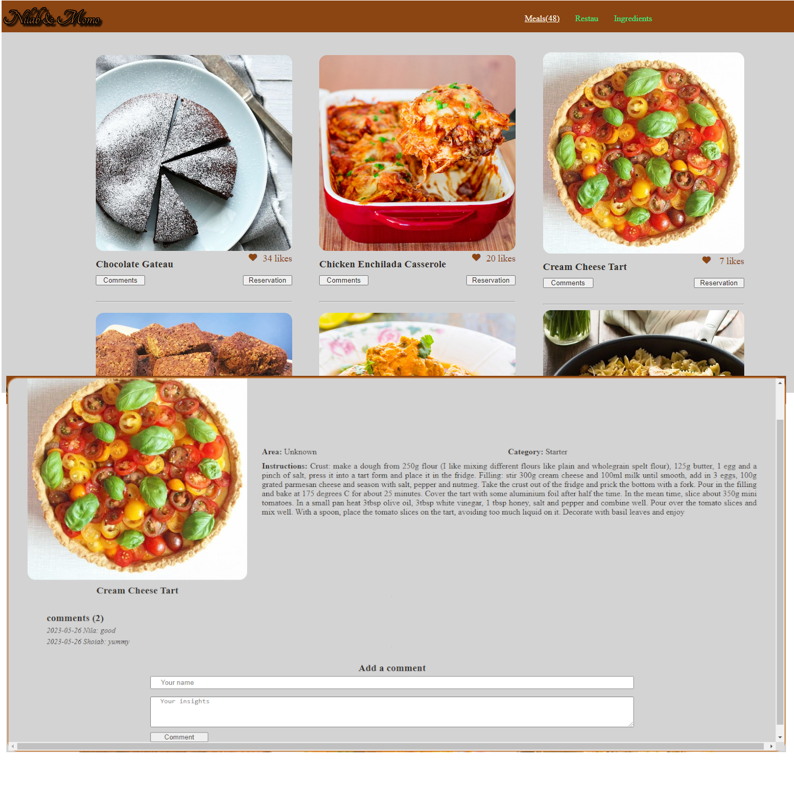

<a name="readme-top"></a>
<div align="center">
  
  
  <br/>
  
  <h2><b>API-based Webapp</b></h2>
</div>
<div align="center">
  
</div>

# 📗 Table of Contents

- [📖 About the Project](#about-project)
  - [🛠 Built With](#built-with)
    - [Tech Stack](#tech-stack)
    - [Key Features](#key-features)
  - [🚀 Live Demo](#live-demo)
- [💻 Getting Started](#getting-started)
  - [Setup](#setup)
  - [Prerequisites](#prerequisites)
  - [Install](#install)
  - [Usage](#usage)
  - [Run tests](#run-tests)
  - [Deployment](#triangular_flag_on_post-deployment)
- [👥 Authors](#authors)
- [🔭 Future Features](#future-features)
- [🤝 Contributing](#contributing)
- [⭐️ Show your support](#support)
- [🙏 Acknowledgements](#acknowledgements)
- [❓ FAQ (OPTIONAL)](#faq)
- [📝 License](#license)

<br>

# 📖 API-based Webapp <a name="API-based webapp"></a>
> This project is about building an web application based on an external API.
<br>

## 🛠 Built With <a name="built-with"></a>
- JavaScript
- HTML
- CSS
- Webpack
- Jest for testing

### Tech Stack <a name="tech-stack"></a>
<details>
  <summary>Client</summary>
  <ul>
    <li><a href="https://www.javascript.com/">JavaScript</a></li>
    <li><a href="https://developer.mozilla.org/en-US/docs/Web/HTML">HTML</a></li>
    <li><a href="https://developer.mozilla.org/en-US/docs/Web/CSS">CSS</a></li>
    <li><a href="https://webpack.js.org/guides/getting-started/#basic-setup">Webpack</a></li>
    <li><a href="https://jestjs.io/docs/getting-started">Jest</a></li>
  </ul>
</details>
<details>
  <summary>API</summary>
  <ul>
    <li><a href="https://www.themealdb.com/api.php">TheMealDB</a></li>
    <li><a href="https://microverse.notion.site/Involvement-API-869e60b5ad104603aa6db59e08150270">Involvement API</a></li>
  </ul>
</details>
<br>

### Key Features <a name="key-features"></a>
- A home page showing a list of items that a user can "like."
- A popup window with more data about an item that user can use to comment on it.
<p align="right">(<a href="#readme-top">back to top</a>)</p>

## 🚀 Live Demo <a name="live-demo"></a>
>[Live Demo](https://momo-87.github.io/JS-capstone-project/)
<p align="right">(<a href="#readme-top">back to top</a>)</p>


## 💻 Getting Started <a name="getting-started"></a>
>To get a local copy up and running, follow these steps.

### Prerequisites
1. Web browser.
2. Code Editor.
3. Git-smc.

### Setup
> To clone this repository to your desired folder, run this command:
```sh
  cd my-folder
  git clone https://github.com/momo-87/JS-capstone-project.git
```

### Install
> Run this command:
```sh
  cd my-project
  npm install
```

### Usage
> To run the project, open index.html from dist folder using live server extension.

### Run tests
> Coming soon

### Deployment
> Published
<p align="right">(<a href="#readme-top">back to top</a>)</p>


## 👥 Author <a name="authors"></a>
👤 Christian Romuald MOMO TONFACK
- GitHub: [@githubhandle](https://github.com/Momo-87)
- Twitter: [@twitterhandle](https://twitter.com/Momo_yde)
- LinkedIn: [LinkedIn](https://www.linkedin.com/in/christian-momo/)
<p align="right">(<a href="#readme-top">back to top</a>)</p>


## 🔭 Future Features <a name="future-features"></a>
- [ ] A popup window with more data about an item that user can use to reserve it for a period of time.
<p align="right">(<a href="#readme-top">back to top</a>)</p>

## 🤝 Contributing <a name="contributing"></a>
> Contributions, issues, and feature requests are welcome!
Feel free to check the [issues page](https://github.com/momo-87/JS-capstone-project/issues).
<p align="right">(<a href="#readme-top">back to top</a>)</p>


## ⭐️ Show your support <a name="support"></a>
>If you like this project just give it a star ⭐️.
<p align="right">(<a href="#readme-top">back to top</a>)</p>

## 🙏 Acknowledgments <a name="acknowledgements"></a>
>I would like to thank Microverse comnunity for their supports.
<p align="right">(<a href="#readme-top">back to top</a>)</p>

## 📝 License <a name="license"></a>
>This project is [MIT](./LICENSE) licensed.
<p align="right">(<a href="#readme-top">back to top</a>)</p>
